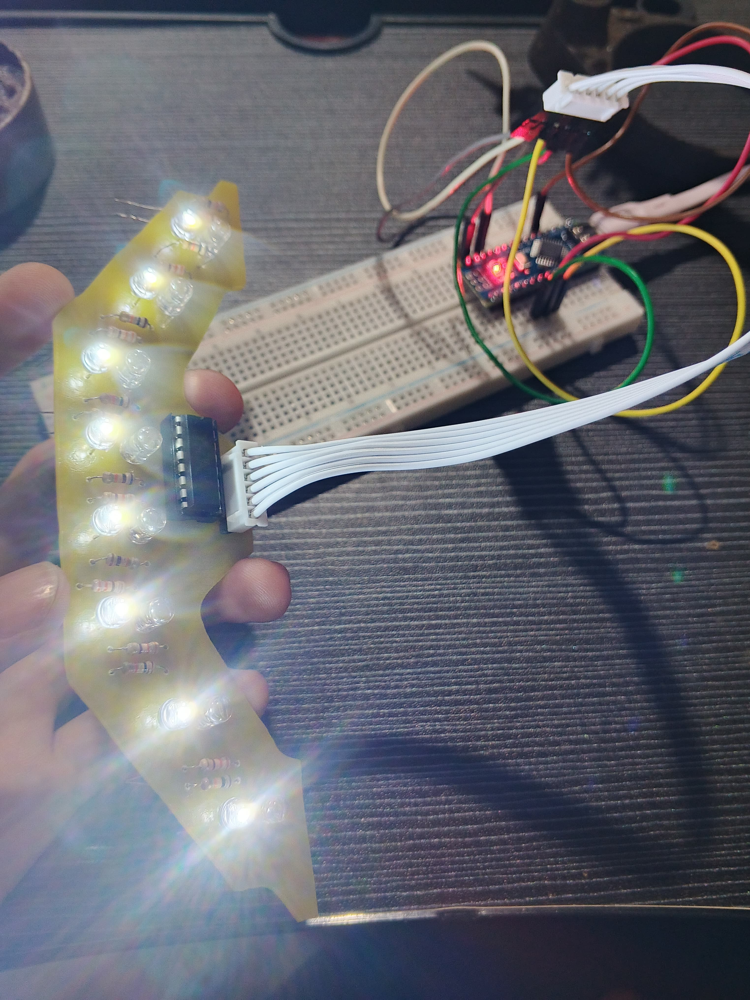
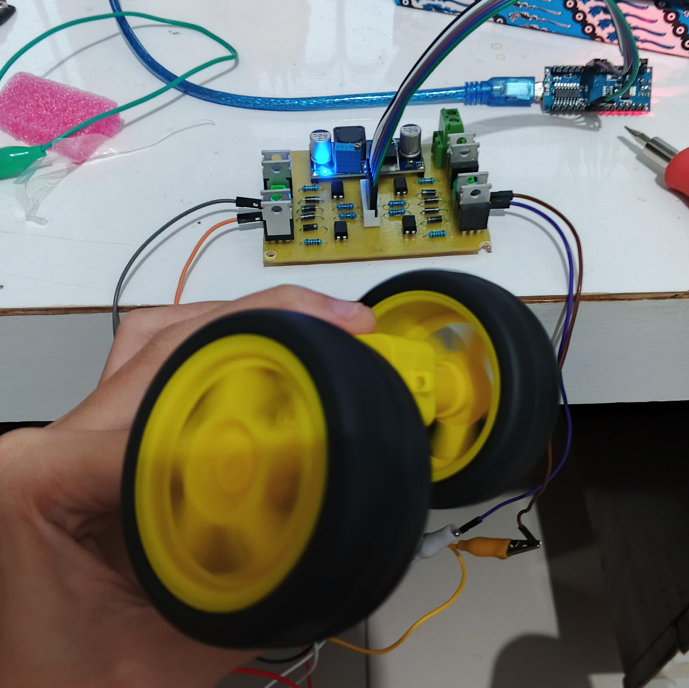
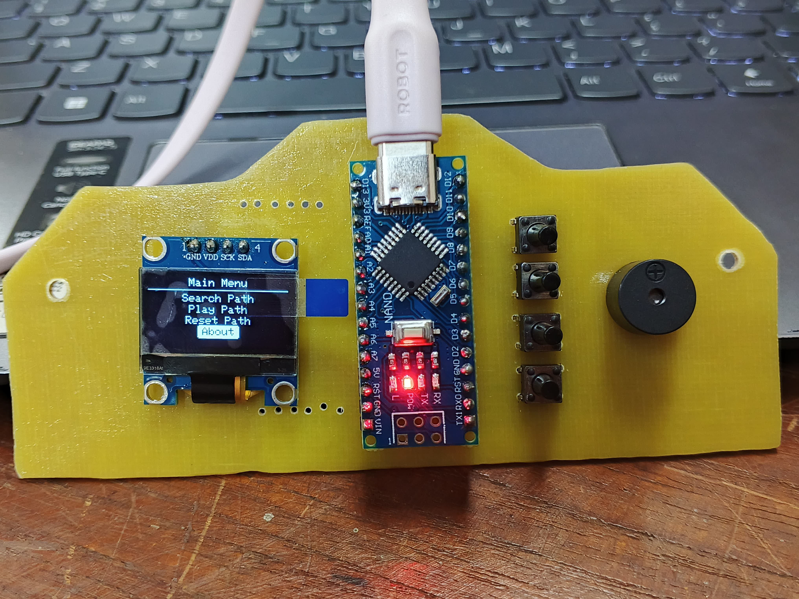

# 🕹️ Line Maze Robot

The **Line Maze Robot** is an intelligent line-following robot designed to navigate and determine the fastest path through a black-and-white arena. Built using three custom PCBs, this robot is an exciting blend of sensor systems, motor control, and interactive user interface.

## 🚀 Project Goal

Enable the robot to:
- Detect intersections and paths on a black-and-white grid.
- Record and analyze paths using internal logic.
- Determine and follow the **fastest route** to complete the arena.

---

## 🧩 System Overview

### 🔧 Hardware Structure

#### 1. **Sensor PCB**
- **8 pairs of Super Bright LEDs and Photodiodes** for line detection.
- **74HC4051 Analog Multiplexer** for efficient input switching.

#### 2. **Main PCB**
- **2x H-Bridge Circuits** for controlling left and right DC motors.
- **Buck Converter** for stable voltage regulation.

#### 3. **Display PCB**
- **Arduino Nano** – the central microcontroller.
- **OLED Display** – shows menu and robot status.
- **4 Push Buttons** – for user interaction and menu navigation.
- **Buzzer** – audio feedback for actions and events.

---

## 🧠 Features

- 🧭 **Pathfinding Logic**: Detect and map intersections, turns, and straight paths.
- 🗺️ **Fastest Path Detection**: Smart decision-making to replay the quickest route.
- 🎛️ **Interactive Menu**: Use buttons and OLED screen to control:
  - `Search Path`
  - `Play Path`
  - `Reset Path`
  - `About`
- 🔊 **Audio Feedback**: Buzzer sounds indicate different modes and actions.

---

## 🔌 Wiring Diagram

📌 *Coming soon: Circuit diagrams and connection schematics.*

---

## 📸 Gallery

  

  <em>Figure 1: Sensor PCB – 8 LED-photodiode pairs and 74HC4051 multiplexer</em>

  

  <em>Figure 2: Main PCB – Motor driver board with dual H-Bridges and buck converter</em>

  

  <em>Figure 3: Display PCB – Arduino Nano, OLED screen, buttons, and buzzer</em>

---

## 🛠️ Tools & Libraries

- Arduino IDE / PlatformIO
- Adafruit SSD1306 (for OLED)
- Timer library / AnalogRead
- Custom PWM logic for motor speed

---

## 📚 Future Improvements

- ⚙️ PID control for smoother movement
- 📍 Map memory optimization

---

## 🙌 Credits

Archived in [thoriqpb](https://github.com/thoriqpb). Special thanks to mentors and collaborators who supported the development of this line maze robot project.

**Team Members:**
- Thoriq Putra Belligan  
- Fajari Ani Novita Sari  
- Muhammad Harits Naufal K  
- Muhammad Adib Elfito

---

